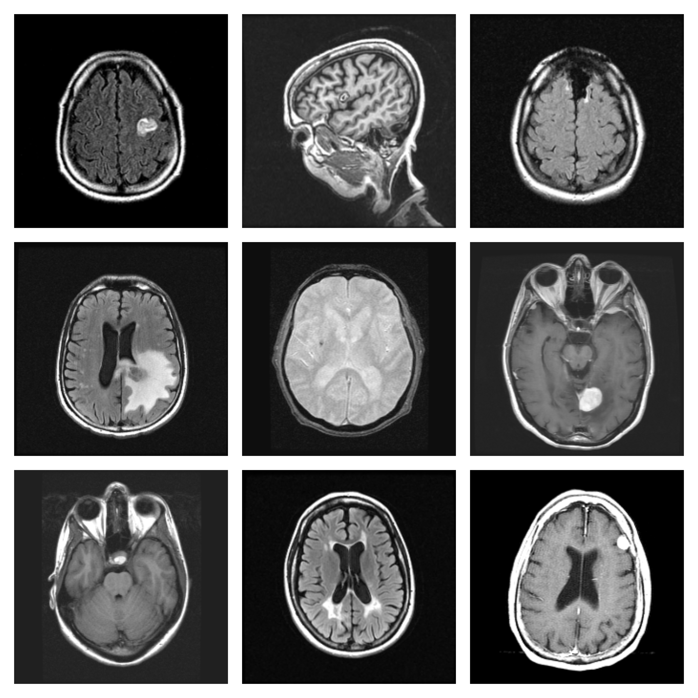
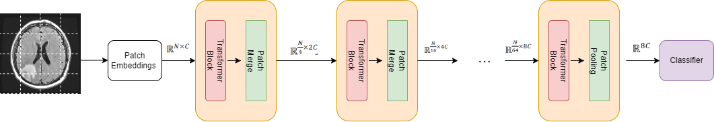
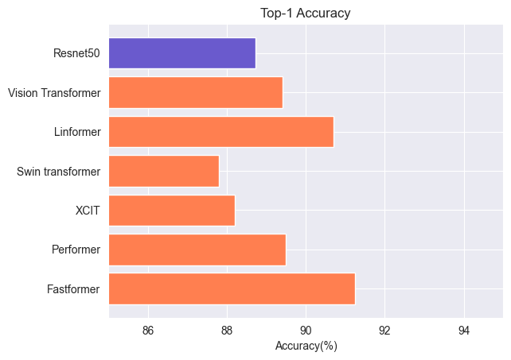
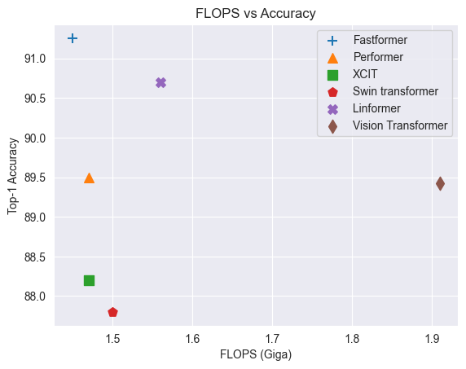
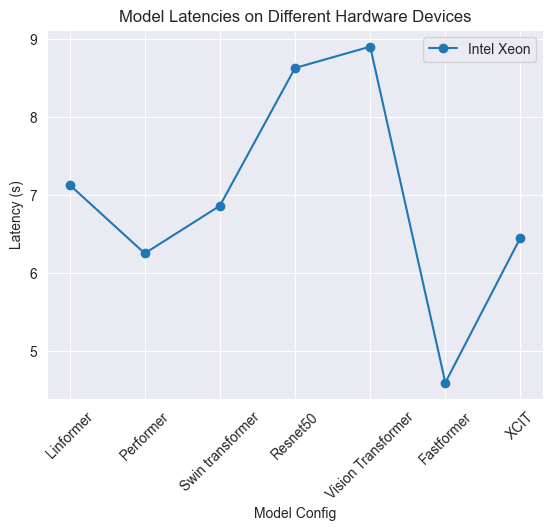
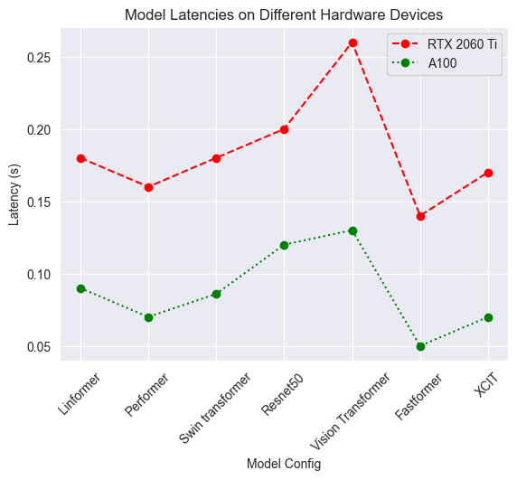

# Benchmarking Efficient Transformers for Medical Imaging

**Team Members**

- Makesh Sreedhar (msreedhar[at]wisc.edu)
- Gowtham Ramesh (gramesh4[at]wisc.edu)
- Kriti Goyal (kgoyal6[at]wisc.edu)

**Important Links**:
* [Project Presentation](https://docs.google.com/presentation/d/1Uhy1qlZEpGZ4DNiAhHwD8F9stMAv5h5TyGHepr6FybI)
* [Project Video](https://drive.google.com/file/d/1CJ6hqsogIZj9_mM7asaY1XhzlDHUQ85J/view)
* [Code Repository](https://github.com/gowtham1997/Benchmarking-Efficient-Transformers-for-Medical-Imaging)

1. TOC
{:toc}

<html>
<head>
  <meta charset="utf-8">
  <meta name="viewport" content="width=device-width">
  <title>MathJax example</title>
  
  
</head>
<body>

# Introduction

Recently, deep learning models have shown remarkable performance in
different vision tasks ranging from classification, segmentation,
text-to-image generation, and more. Instead of modality-specific
architectures (CNN for vision, LSTM for NLP, etc.), most modern works
use transformer [[3]](#3) networks that can work with
images, text [[4]](#4) and even some
combination of multiple modalities. In this project, we look at
benchmarking inference times(FLOPS/image per sec) across different
vision architectures from the popular CNN-based ResNet, Vision
transformer, and some efficient sparse [[7]](#7), [[8]](#8), [[10]](#10), [[9]](#9)
attention alternatives on medical image classification. We would also
like to analyze how the attention mechanism differs between different
architectures and its effect on downstream performance.

Edge computing in medical fields and radiology has tremendous potential,
and there has been a lot of interest from the medical and computer
vision community in utilizing the latest research developments to build
better devices. However, one trend we notice among all the research work
on efficient transformers is that there has been no comprehensive
comparison between various methods using the same configuration or task
setting. Many comparisons in such methods cannot be considered fair
because they use different training schemes or model configurations.
This makes the task of choosing a particular architecture difficult for
the stakeholder. In this work, we would like to alleviate this issue by
ensuring a fair comparison between different architectures and attention
mechanisms.

# Problem Statement

In this project, we plan to benchmark the classifier performance and
inference time (computational complexity) of different models (CNNs,
ViT, and efficient transformers) on a common medical classification
task. Previous studies on these various architectures, especially in
comparing quadratic self-attention with other efficient variants, have
had different training schemes or configurations, making it challenging
to identify trade-offs. We aim to alleviate this by conducting a
comprehensive study in which we keep the architectures consistent for
transformer-based models and only modify the attention mechanism to
capture the impact on downstream performance accurately.

# Datasets and Evaluation

The RadImageNet[[12]](#12) dataset includes 1.35 million annotated
ultrasound, radiographs, and CT scans for several classification tasks
based on medical imaging. It is publicly available for research, and the
RadImageNet team approved our request to use this dataset.

After checking the class distributions of each dataset and fitting some
baseline models, we selected the Brain MRI dataset. This dataset
contains MRI scans of patients with brain injuries/anomalies - an
arteriovenous anomaly, white matter changes, etc. and scans of normal
brains. The dataset contains 10 classes - 9 types of brain injuries/
anomalies and normal brain scans. The dataset is also imbalanced, making
it a challenging benchmark to baseline our models. Table
[1](#brain-mri) shows the
class distribution of this dataset.

| Label                 | Count |
| --------------------- | ----- |
| Acute infarct         | 513   |
| Arteriovenous anomaly | 272   |
| Chronic infarct       | 2307  |
| Edema                 | 125   |
| Extra                 | 1259  |
| Focal flair hyper     | 751   |
| Intra                 | 1721  |
| Normal                | 27374 |
| Pituatary lesion      | 83    |
| White matter changes  | 10266 |

## Primer on Brain injuries and potential features that model would use for classification:

* **Acute infarct**: An acute infarct, also known as a stroke, is a type of brain injury that occurs when blood flow to a specific area of the brain is disrupted, causing brain tissue to die. The model might look for evidence of this in the brain scan, such as areas of decreased blood flow or areas of dead brain tissue.
* **Arteriovenous anomaly**: An arteriovenous anomaly is a type of brain injury in which there is a abnormal connection between the arteries and veins in the brain.
* **Chronic infarct**: Chronic infarcts are brain injuries that occur over a longer period of time, as opposed to acute infarcts which occur suddenly. Chronic infarcts are caused by a disruption in blood flow to the brain, resulting in brain tissue death. These changes are typically visible on brain scans as darker contours clearly constrating against the normal brain's grey color and the model can be trained to recognize them.
* **Edema**: Edema, or swelling, in the brain can be a sign of a brain injury. It occurs when excess fluid builds up in the brain, causing the tissue to become swollen. This can lead to additional damage to the brain.
* **Extra**: Extra is a term used to describe anything that is outside of the normal range or expectation. In the context of brain injuries, it may refer to abnormalities or conditions that are not typical or expected.
* **Focal flair hyper**: Focal flair hyper refers to a specific type of brain injury in which there is an increase in blood flow to a particular area of the brain. This increase in blood flow can be a sign of injury or damage to the brain tissue. This can typically be seen on brain scans as an area of increased brightness or contrast.
* **Intra**: Intra is a term that means "within" or "inside." In the context of brain injuries, it may refer to injuries or conditions that affect the brain tissue directly, rather than affecting the blood vessels or other structures outside of the brain.
* **Normal**: Normal in this context refers to the absence of brain injuries or abnormalities. A "normal" brain scan would show no evidence of injuries or other conditions.
* **Pituatary lesion**: A pituitary lesion is a type of brain injury that affects the pituitary gland, which is a small gland located at the base of the brain. Pituitary lesions can interfere with the gland's ability to produce hormones, which can lead to a wide range of health problems. The model would try to look for abnormalities around the pituitary gland.
* **White matter changes**: White matter changes refer to changes in the white matter of the brain, which is made up of nerve fibers that carry signals between different areas of the brain. The model can be trained to look for changes in the size, shape, or density of the nerve fibers that make up the white matter.

For image classification - accuracy, AUC, sensitivity, and specificity /
Cohen Kappa are some standard evaluation metrics. Each has its own
metrics and depends on the class imbalance, importance of output
misclassification, interpretability, etc. For the midterm report, we
have baselined the models with evaluation top1 and top5 accuracy. Top1
accuracy measures the accuracy of the top prediction of the model while
Top5 measures whether the right class is predicted in the top5
predictions of the model. We will also include metrics that take class
imbalances into account for the final project submission.

We will use FLOPS (Floating point operations per second) and inference
latency to measure model efficiency during deployment. We will also
benchmark these models across different platforms - CPU machine with
multiple cores like Intel Xeon, a slightly older Nvidia GPU like
1080Ti/K80 (which doesn't have tensor cores), and a modern Nvidia GPU
like RTX 3090.

We choose the above efficiency metrics as FLOPs are not a proxy for
latency [[13]](#13), i.e., a model with the same FLOPS has different
latencies on different hardware.

# Models

### Resnet-50 (CNN Baseline)

ResNet-50[[11]](#11) is a deep convolutional neural network trained on
more than a million images from the ImageNet database. The network is 50
layers deep and can classify images into 1000 different categories. It
is one of the first networks to propose using residual connections that
help the training process by allowing information to flow more freely
between layers. Residual connections help the model learn the identity
function and enable multiple layers to be stacked, allowing us to create
much deeper models.

### Vision Transformer

The ViT[[1]](#1) model uses a Transformer-like architecture to classify images.
An image is split into fixed-size patches, each patch is embedded,
position embeddings are added, and the resulting sequence of vectors is
fed to a standard Transformer encoder. The standard approach of adding
an extra learnable classification token to the sequence is used to
perform classification.

The self-attention mechanism in the transformer is used to calculate a
weighted sum of the input vectors, where the weight for each vector is
based on the dot product of the query vector with the key vector for
that vector.

This can be written mathematically as:

 $$\mathrm{Attention}(Q, K, V) = \mathrm{softmax}\left(\frac{QK^T}{\sqrt{d_k}}\right)V$$ 

where \(Q\) is the query matrix, \(K\) is the key matrix, \(V\) is the value
matrix, and \(d_k\) is the dimension of the keys.

## Efficient Transformers

### Linformer

Linformer[[7]](#7) is a linear transformer that breaks down the self-attention
mechanism into smaller, linear attentions (converts O(n^2) in self
attention to O(n)) with linear attention). This allows the Transformer
model to avoid the self-attention bottleneck. The original scaled
dot-product attention is decomposed into multiple smaller attentions
through linear projections. This combination of operations forms a
low-rank factorization of the original attention.

$$\operatorname{LA}(\mathbf{q}, \mathbf{k}, \mathbf{v})=\operatorname{softmax}\left(\frac{\mathbf{q}\left[W_{\text {proj }} \mathbf{k}\right]^T}{\sqrt{d_k}}\right) W_{\text {proj }} \mathbf{v}$$

Here, \(q\) is the query vector, \(k\) is the key vector and \(W_{proj}\) is
the projection matrix for the smaller self-attention spans.

### XCIT

XCIT[[14]](#15) uses a variant of self-attention known as cross-covariance
attention. It is a transposed version of self-attention that operates
across the feature dimension rather than across the tokens. The authors
of this architecture observed that using this form of attention led to
worse interaction between tokens and degraded the quality of
representations learned. To overcome this, XCiT introduced a local patch
interaction module (LPI) consisting of two convolution layers. The
attention mechanism used in this model is mathematically represented as

 

$$\operatorname{XCA}(\mathbf{q}, \mathbf{k}, \mathbf{v})=\left[\operatorname{softmax}\left(\frac{\|\mathbf{q}\|_2^T\|\mathbf{k}\|_2}{\tau}\right) \mathbf{v}^T\right]^T$$

### Fastformer

The Fastformer[[8]](#8) model uses element-wise multiplication to compute attention instead of using matrix multiplication. This allows the model to incorporate global context into each token representation. The fastformer uses learnable parameters to compute the global context and then applies element-wise multiplication to combine the context with the input tokens. The resulting attention is then projected using a learnable parameter. The computation complexity of this attention mechanism is O(NC). The equation for the additive attention used in the fastformer model is as follows:

 

 $$AA(q, k, v) = q + [k0 * v]W$$

where \(k0\) is computed using \(q0\) and \(*\) denotes element-wise multiplication. W is the projection parameter.

### Swin Transformer
The Swin transformer[[10]](#10) is a variant of the transformer model that uses a sparse self-attention mechanism to reduce computation complexity. It uses a nested window attention with normal self-attention to focus on global interactions. The computation complexity of this attention mechanism is O(NCw^2), where w is the size of the window. In experiments, the size of the window is typically set to 7 or 8 when using patch sizes of 4 or 7, respectively.

### Performer

The Performer[[9]](#9) model is an improved version of an attention mechanism that uses kernel approximation to compute attention. It uses a kernel function and a positive orthogonal random feature to approximate the softmax function. The performer model's attention equation is given as:

$$PA(q, k, v) = \frac{\psi(q)[\psi(k)^T v]}{\text{diag}(\psi(q)[\psi(k)^T \mathbb{1}_n])}$$

where:

* \( ψ(·) : R dq → R r + \) is the kernel function using a positive orthogonal random feature
* IN is an N x N identity matrix
* The computation complexity of this attention mechanism is O(NCr), where r is the project dimension. In experiments, r is typically set to \(C^2\) to ensure that it is smaller than N.

### Complexity for Efficient Attention mechanisms

A image of size \(H X W X M\) is first divided into smaller tokens of size \(P\) X \(P\) X \(M\) where \(P\) is the patch size and \(M\) is the number of channels. The total number of tokens is \(N = H * W / P^2\).

These image patches are then projected to a dimension of \(C\) using a linear projection. The complexity of each attention mechanism is given below:

| Model                   | Architecture Complexity |
| ----------------------- | ----------------------- |
| Transformer (SA)        | O($$N^2C$$)             |
| Linformer (LA)          | O($$N^2C$$)             |
| Performer (PA)          | O($$NC^2$$)             |
| Fastformer (AA)         | O($$NC$$)               |
| XCiT (XCA)              | O($$NC^2$$)             |
| Swin Transformer (Swin) | O($$NC^3$$)             |

## Model Architecture - Transformer Backbone

In order to perform a fair comparison across the different attention mechanisms, we use a common transformer backbone architecture for all our experiments.

* We first divide the input images into a fixed number of patches (for all results here, we use the patch size as 7)
* We then obtain the patch embeddings that are fed as input to a sequence of modules. Each module includes a **Transformer block** and a **Patch Merge** operation.
* The Patch Merge operation combines every 2 x 2 patch into a single one as the depth of the model increases. This has the effect of reducing the sequence length (number of patches).
* In the final module, instead of a Patch Merge operation, we have a **Patch Pooling** operation. This effectively averages the representation over all patches giving us a single feature vector for the image that is then fed as input to the linear **Classifier** layer.
* The model is optimized using the Cross-Entropy loss.
* For each of our experiments, the overall structure of the model remains fixed and only the **type of attention** used in the Transformer layers is modified.

# Results

## Top-1 Accuracy

For all of the models we have included as part of this report, we adjust
the model configuration (number of layers, feed-forward units, etc.) to
approximately 28M parameters. This allows us to conduct a fair
comparison of the models by changing the attention mechanisms while
keeping all other factors the same.

The general trends we observe from the accuracy scores are

  * Transformer models outperform the CNN baseline.
  * Efficient attention models perform as well as or sometimes even better than the full self-attention model.
  * Fastformer is our best performing model with a top-1 accuracy of 91%.

## Benchmarking the FLOPS and Inference Latency

| Model Config       	| Intel Xeon(s) 	| Nvidia RTX 2060 Ti(s) 	| Nvidia A100(s) 	| FLOPS (Giga)    	| Parameters (M) 	|
|--------------------	|------------	|--------------------	|------------	|---------------	|----------------	|
| Linformer          	|     7.13    	|         0.18        	|    0.09    	|     1.56      	| 28.56       	|
| Performer          	|     6.249    	|         0.16         	|    0.07    	|     1.47      	| 28.28       	|
| Swin transformer   	|     6.86   	|         0.18        	|    0.086   	|     1.50      	| 28.28       	|
| Resnet50           	|     8.63    	|         0.2         	|    0.12     	|     4.00      	| 25.6        	|
| Vision Transformer 	|     8.904    	|         0.26        	|    0.13    	|     1.91      	| 28.27       	|
| Fastformer         	|     4.589    	|         0.14         	|    0.05     	|     1.45      	| 28.28       	|
| XCIT               	|     6.452    	|         0.17         	|    0.07     	|     1.47      	| 28.28       	|

**NOTE** : Higher FLOPs != slower inference

* FLOPs is hardware agnostic, while inference time depends on the device we deploy the model on.
* Different devices have optimizations and parallelizations for various architectures, hence inference latency and FLOPs are not necessarily correlated.

### FLOPs vs Accuracy

* Resnet-50 is not shown in the above plot since it distorts the scale. It uses 4 GFLOPs worth of computation.
* Efficient Transformer models, on average, utilize ~35% fewer FLOPs than the full self-attention model.
* Fastformer, our best performing model, also uses the least FLOPs - best of both worlds.

### Inference Latencies on CPU

* We use the 2nd generation Intel Xeon Platinum 8000 series processor with all cores to compute the latency.
* We use a batch size of 1 and average the latency over the entire test set.
* Even though Resnet-50 uses 2.5x more FLOPs than the full self-attention transformer model, it has a lower latency time. This is because the convolution operation has been parallelized and optimized heavily for inference.

### Inference Latencies on GPU

* We consider two classes of GPUs for inference - the RTX 2080Ti and the latest model A100.
* While running on the GPUs, instead of a cold start, we run a few batches for warm up and then measure inference latency. A cold start can lead to unreliable inference numbers.
* An interesting trend to observe here is that on newer GPUs that are optimized for transformers (green curve for A100) we observe a drastic reduction in the relative difference between inference time of full self attention Transformer model and the Resnet-50.

## Integrated Gradients and Saliency Maps

We use saliency maps to help us identify which locations in the image are important for the classification decision. Saliency maps utilize the magnitude of gradients to determine points in the image that play a crucial role in making the prediction. Higher the gradient magnitude at a particular point, the more important that location is for the image classification decision.

* The first column is the input image, the second column is the magnitude of gradients and the third column superimposes the saliency map onto the original image.
* The saliency maps in the above image are from the Fastformer model - we did not notice any major differences between the various transformer models.
* This is promising - Approximation of the attention mechanism does not affect the interpretability of the model!

 

</body>
</html>

# Gradio Demo

Please use the above image from our test set to try out the demo. You can find more images from our test set [here](https://github.com/gowtham1997/CS639-website/tree/main/gradio_sample_images)

<iframe src="https://f5db3d010e2e6201.gradio.app" width="1200" height="900"></iframe>

If the above demo is not working as expected, please feel free to email us at {msreedhar/gramesh4}[at]wisc.edu

## References
<a id="1">[1]</a> [An Image is Worth 16x16 Words: Transformers for Image Recognition at Scale](https://arxiv.org/abs/2010.11929) 
<a id="2">[2]</a> [Towards Robust Vision Transformer](https://arxiv.org/abs/2105.07926) 
<a id="3">[3]</a> [Attention Is All You Need](https://arxiv.org/abs/1706.03762) 
<a id="4">[4]</a> [BERT: Pre-training of Deep Bidirectional Transformers for Language Understanding](https://aclanthology.org/N19-1423) 
<a id="5">[5]</a> [ViLBERT: Pretraining Task-Agnostic Visiolinguistic Representations for Vision-and-Language Tasks](https://proceedings.neurips.cc/paper/2020/file/2f1b0e9b9d9d9f9f9f9f9f9f9f9f9f9f-Paper.pdf) 
<a id="6">[6]</a> [Deep Residual Learning for Image Recognition](https://arxiv.org/abs/1512.03385) 
<a id="7">[7]</a> [Linformer: Self-Attention with Linear Complexity](https://arxiv.org/abs/2006.04768) 
<a id="8">[8]</a> [Fastformer: Additive Attention Can Be All You Need](https://arxiv.org/abs/2108.09084) 
<a id="9">[9]</a> [Rethinking Attention with Performers](https://arxiv.org/abs/2009.14794) 
<a id="10">[10]</a> [Swin Transformer: Hierarchical Vision Transformer using Shifted Windows](https://arxiv.org/abs/2103.14030) 
<a id="11">[11]</a> [ImageNet Classification with Deep Convolutional Neural Networks](https://proceedings.neurips.cc/paper/2012/file/4f7a7e7b9d9d9f9f9f9f9f9f9f9f9f9f-Paper.pdf) 
<a id="12">[12]</a> [RadImageNet: An Open Radiologic Deep Learning Research Dataset for Effective Transfer Learning](https://doi.org/10.1148/ryai.210315) 
<a id="13">[13]</a> [Hat: Hardware-aware transformers for efficient natural language processing](https://arxiv.org/abs/2005.14187) 
<a id="15">[14]</a> [XCiT: Cross-Covariance Image Transformers](https://arxiv.org/abs/2106.09681) 
