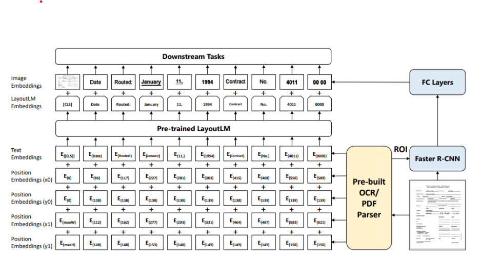
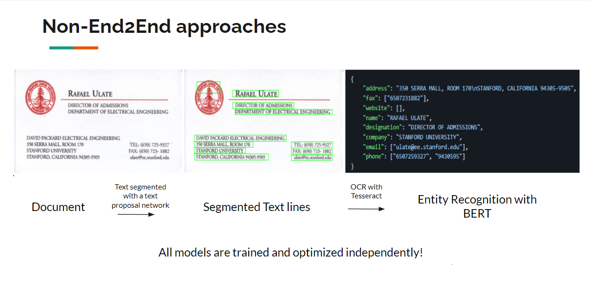
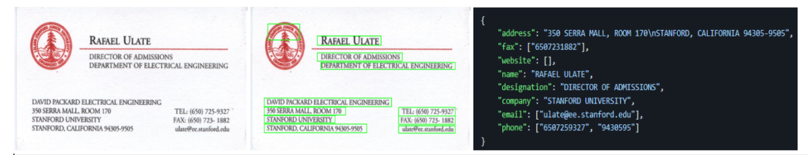
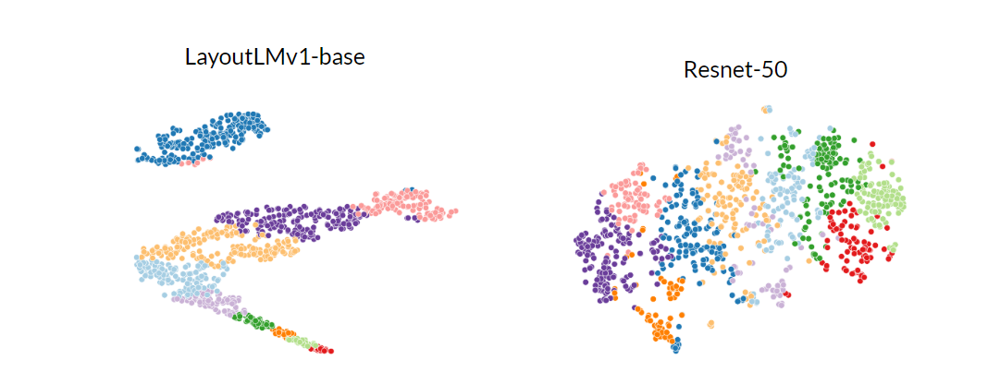

# Comparison of end2end and non-end2end multimodal systems for Document understanding tasks

**Team Members**

- Gowtham Ramesh (gramesh4[at]wisc.edu)
- Sai Nikhilesh (krishnamurt6[at]wisc.edu)

**Important Links**:
* [Project Presentation](https://docs.google.com/presentation/d/1BBncP_47NYVJuRKSjDor3BBBGDCyg22n_Jp5UM1fvIE/edit#slide=id.p)

1. TOC
{:toc}

<html>
<head>
  <meta charset="utf-8">
  <meta name="viewport" content="width=device-width">
  <title>MathJax example</title>
  
  
</head>
<body>

# Introduction

The field of multi-modal deep learning is rapidly developing, with
the goal of creating models that can process and understand data from multiple
sources like text, images, and audio. The integration of different modalities,
such as text, images, and audio, is becoming increasingly important in areas
such as natural language processing, computer vision, and robotics. In this
project, we aim to compare the embeddings of end-to-end multi-modal systems,
which incorporate both CNN and transformer networks [9] trained together,
with non-end-to-end systems that process individual modalities for tasks
involving text-rich images such as receipts/visiting cards and PDF documents.

# Problem Statement

In this project, we plan to compare the end2end and non-end2end multimodel
systems for Document understanding tasks where the primary focus lies on
1. what is the qualitative and quantitative quality of the embeddings
generated by end to end multimodel systems as compared to non-end-to-end
approaches
2. How do the two approaches compare in terms of the amount of text present in
the images, considering low-text content scenarios such as visiting cards and
high-text content scenarios like documents?
<!-- 3. How do the two approaches perform in scenarios with limited data resources,
such as low-resource settings, compared to high-resource settings
for fine-tuning? -->

By answering the questions posed in this project, we can better understand the
effectiveness and efficiency of end-to-end approaches compared to non-end-to-end
approaches for processing such datasets. Additionally, it is an interesting research
question to explore the benefits of end-to-end approaches, as they are generally more
challenging to train than non-end-to-endcounterparts. Overall, this project has
practical implications for industry and academic researchers in developing better
multi-modal deep learning models for text-rich datasets.

# Datasets and Evaluation

Stanford Visual search dataset[2]: Though this dataset was created for visual
image search. Some of the subsets, like book covers, business cards, and DVD
covers, have images that have text. We plan to use the business cards dataset so
that we can also test the models on entity extraction + detection. In total, we have 480 images with each image containing up to 8 fields - name, phone, address, fax, website, email, designation and company.

FUNSD[4]: The FUNSD dataset is a collection of annotated forms in various
formats, including scanned PDFs and images, designed for form understanding
tasks such as layout analysis, information extraction, and field identification.
The dataset contains 199 real, fully annotated, scanned forms, as shown in
Figure 1.

RVL-CDIP dataset[7]: Unlike the other three datasets, which focus on entity
extraction, this dataset contains images of emails, documents, invoices, scientific
text, etc, and we intend to use this for quanlititative check of image embeddings for document classification. Specifically, It consists of 400,000 grayscale images in 16 classes, with 25,000 images per class. To make training on a small scale, we only train on 50K images preserving the class distribution.

In summary, we plan to use 3 datasets - one with less text, one with denser
text for entity recognition and a dataset for document classification/ clustering.

# Models

### End2EndModel - LayoutLM (Deep Learning Model)

LayoutLM is a multimodal Transformer model which is used to
perform document processing.
It is a pre-training model that incorporates both text and layout
information for document image understanding. The authors demonstrate that
LayoutLM achieves state-of-the-art performance on several image- text downstream
tasks by jointly pre-training on text and layout tasks. LayoutLM is built
on top of the widely used BERT architecture and extends it to incorporate
layout information by adding an additional layout embedding layer.
We plan to use LayoutLM as our end to end model for this project.

### Non End2EndModel - CTPN

CTPN refers to Connectionist Text Proposal Network. This name was given to this model
because it detects text lines in sequence of text proposals.
It uses a pre-trained VGG16 model to extract features from the image
and then uses a recurrent neural network to generate text proposals.
The proposals are then scored and refined; the final text boxes are output.
The CTPN has several advantages over previous methods for detecting text in natural images.
First, it is able to detect text in a wider range of conditions, including low-light and cluttered images.
Second, it is able to detect text of different sizes and fonts. Third, it is able to detect text in multiple languages.
We will use CTPN as the visual model for the non-end-to-end variant to
extract text proposals. These text proposals would then be fed to OCR systems
for text and LSTM/transformer-based networks for entity recognition. All these
systems would be optimized separately.

### BERT (Natural Language Processing Model)

BERT refers to Bidirectional Encoder Representations from Transformers.
This is a language representation model that can be used for a wide range of natural language
processing tasks. It is pre-trained on a massive dataset of unlabeled text with
the masked language model objective, and can be fine-tuned with just one additional output layer
to create state-of-the-art models for a wide range of tasks.
We plan to adapt BERT or a variant of BERT to do entity recognition on
top of OCRed output.

# Results

## Results on FUNSD dataset

Based on the F1 scores shown in the table 1, we can see that the end-to-end
system (LayoutLM) outperformed the non-end-to-end system on all four classes
of the FUNSD dataset as well as the overall F1 score. The largest improvements
were observed in the ”Answer” and ”Other” classes. In fact this the class that
was confused most by the BERT model leading to poorer results for non-end
to end system, while the end2end system uses the conventional question that
follows the answer from the image to get better accuracy.

Comparison of F1 scores on FUNSD dataset by class

 Class       	| Non-end-to-end 	| End-to-end (layoutLM)|
|--------------------	|------------	|--------------------|
| Question         	|     0.79    	|         0.91        	|
| Answer          	|     0.51    	|         0.70         	|
| Header   	|     0.89   	|         0.94        	|
| Other           	|     0.67    	|         0.83         	|
| Overall 	|     0.71    	|         0.845        	|

## Labelling Stanford visual search

As mentioned before, this dataset is intended for visual search, but we repurpose
this dataset to do entity recognition as it is a good benchmark to test images
less text (compared to PDF images which are dense in text). Since we dont have
the entity labels, we create pseudolabels with GPT-3[6] api. A manual check of
25 images entity labels shows that we get 100% accurate entities except for Fax
vs phone. Hence we skip both these classes for evaluation.

## Results on Stanford Visual search dataset

Unlike the FUNSD datset, where the picture was very helpful
in classifying classes, here the entities can just be classified with just the text
and the visual placement might not have a significant effect. Taking a close look
at the results, we find that tessaract sometimes misses @ or . and this leads to
bert model missclassifying emails or websites, but end2end model fares better.

Comparison of F1 scores on the Stanford Visual Search Dataset by class

 Class       	| Non-end-to-end 	| End-to-end (layoutLM)|
|--------------------	|------------	|--------------------|
| Name         	|     0.89     	|         0.93        	|
| Designation          	|     0.98    	|         0.98         	|
| Address   	|     0.79   	|         0.84        	|
| Website           	|     0.69    	|         0.93         	|
| Email 	|     0.72    	|         0.91        	|
| Overall 	|     0.81   	|         0.92        	|

## Qualitative comparison on RVL-CDIP classes

We randomly sampled 100 examples from each class and plotted the TSNE projection of the embedding.
For LayoutLM, we use the [CLS] token, while for resnet we get embedding from image2vec library.

## Conclusion and potential future work

From both quantitative and qualitative results, we see that using layout information and end2end training significantly outperforms pipeline based approaches
For Non-end2end approaches, we find that most of the errors occur due to OCR engine (we use same ocr library for both approaches) but these errors are mitigated in end2end approaches which further integrate layout and image information end2end (Errors propagate in non-end2end approaches)

One potential drawback of end2end approaches is the vast amount of clean pretraining data (document text pairs and document classification datasets) needed to train the model. Ablating these resources and studying their cost comparing non-end2end approaches could be a good future work.

Recent works advocate for OCR free approaches and process image single shot and pass the representations to a pretrained language model decoder which also has capabilities to do zero-shot reasoning (Question answering, mutli-step classification or more)

 

</body>
</html>

## References
<a id="1">[1]</a> Devlin, J., Chang, M.-W., Lee, K., and Toutanova, K. Bert:
Pre-training of deep bidirectional transformers for language understanding, 2019.
  
<a id="2">[2]</a> Dodds, E., Nguyen, H., Herdade, S., Culpepper, J., Kae, A., and
Garrigues, P. Learning embeddings for product visual search with triplet
loss and online sampling, 2018. 
<a id="3">[3]</a> Driess, D., Xia, F., Sajjadi, M. S. M., Lynch, C., Chowdhery, A.,
Ichter, B., Wahid, A., Tompson, J., Vuong, Q., Yu, T., Huang,
6W., Chebotar, Y., Sermanet, P., Duckworth, D., Levine, S., Vanhoucke, V., Hausman, K., Toussaint, M., Greff, K., Zeng, A.,
Mordatch, I., and Florence, P. Palm-e: An embodied multimodal
language model, 2023. 
